# Conductore

Drive Claude Code, Herdr and tmux sessions on your own machines from your phone or desktop, over SSH or Mosh, with no relay server and no account.

[](LICENSE)

[](../../releases)

Conductore runs on Android, iOS, Linux, Windows and macOS from one Flutter
code base, and on desktops and tablets it opens a sidebar and split-pane
shell. It is a fork of
[Conduit](https://github.com/gwitko/Conduit) by gwitko.

<table>
  <tr>
    <td align="center"><br><sub>Home: live sessions and other workspaces</sub></td>
    <td align="center">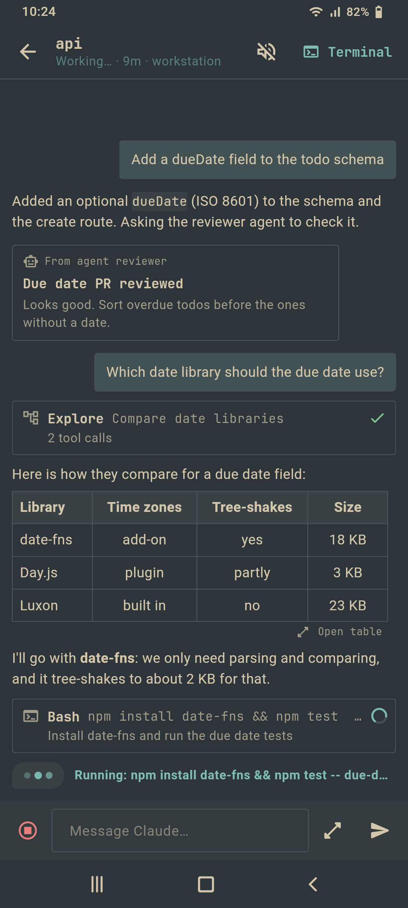<br><sub>Chat View while Claude works</sub></td>
    <td align="center">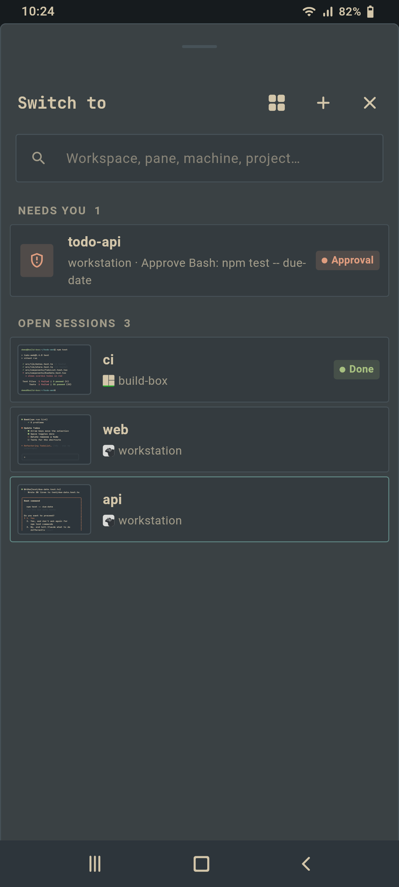<br><sub>Quick switcher</sub></td>
    <td align="center"><br><sub>Terminal on a Herdr session</sub></td>
  </tr>
</table>

<p align="center">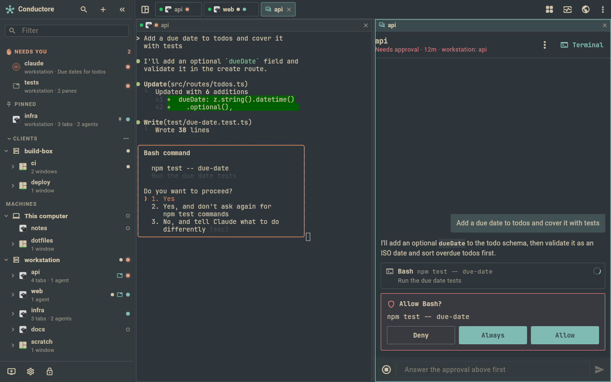<br><sub>The desktop shell: sidebar, a terminal and Chat View in two splits</sub></p>

More in [Screenshots](#screenshots). Jump to [Install](#install).

## Why

- **Your machines, your keys.** Hosts, keys and trusted fingerprints stay on
  your devices. No account, no cloud, no subscription.
- **No relay.** The app connects straight to your machines over SSH or Mosh,
  usually through Tailscale. Nothing sits in the middle and nothing on the host
  listens on a new port. Device sync goes through one of your own machines.
- **Agents first.** The app is built around watching and steering coding agents
  (Claude Code) inside Herdr and tmux, not around a generic terminal.

## New in preview 14

- **Desktop shell** on desktops and tablets (900 dp and wider):
  - a sidebar tree of machines, Herdr workspaces, tabs and agents, and tmux
    sessions and windows, with state dots, unread markers, a **Needs you**
    group, pins, groups, a filter, drag and drop, and a resizable,
    collapsible width;
  - up to 4 split panes that mix terminal, Chat View, file, diff and
    preview, with Chat View opening as a tab;
  - a dashboard home (Needs you, usage, live previews, other workspaces)
    and a right panel (inbox, preview, usage);
  - shortcuts: Ctrl+Shift+\ splits right, Ctrl+Shift+- splits down,
    Alt+arrows move between splits and Ctrl+Shift+U opens the next unread
    (on macOS Cmd+D, Cmd+Shift+D, Cmd+Option+arrows and Cmd+Shift+U).

  Phones are unchanged. See [docs/desktop.md](docs/desktop.md#the-desktop-shell).
- **Usage at a glance** (companion 0.6 or newer): Claude's 5-hour and weekly
  limit rings, today's tokens and an estimated cost at API prices, and a
  breakdown by machine, project, model and day, with Codex when it is
  installed. It shows in a bar on the phone's home screen, the Usage tab,
  and rings on the Android widget and Quick Settings tile. An optional alert
  fires at 80% of the 5-hour window.
- **Voice**:
  - new messages, unlocking and notification sounds no longer cut speech
    off, and calls pause and resume it;
  - read-aloud length: Brief (the default; say "more" in Talk), Full, or a
    Claude summary (companion 0.7 `summarize`);
  - tool activity in Chat View: Show all, Collapsed (the default) or Hidden;
  - speech stays with its own chat when agents open and close;
  - read-aloud and Talk have toggles that are always in the header;
  - the mic is never hidden: it is muted with an explanation instead, and
    Dictate is in the terminal palette and pill.
- **Clearer connection errors**: "Can't reach *machine*", with a Tailscale
  hint for 100.x and `ts.net` addresses, and plain sign-in and host key
  messages, each with Details and Retry. Back from Chat View goes straight
  home.
- **Privacy**: crash reports (self-hosted GlitchTip) and anonymous usage
  counts (self-hosted Plausible), each with a switch in Settings › Privacy.
  See [Privacy](#privacy).
- Host companion **0.7.0**, with the `usage` and `summarize` commands.

<table>
  <tr>
    <td align="center">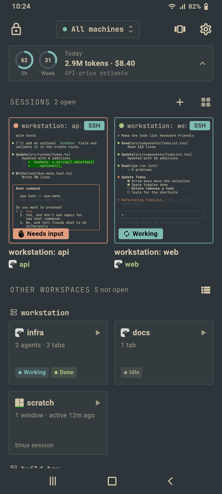<br><sub>Usage bar on the home screen</sub></td>
    <td align="center">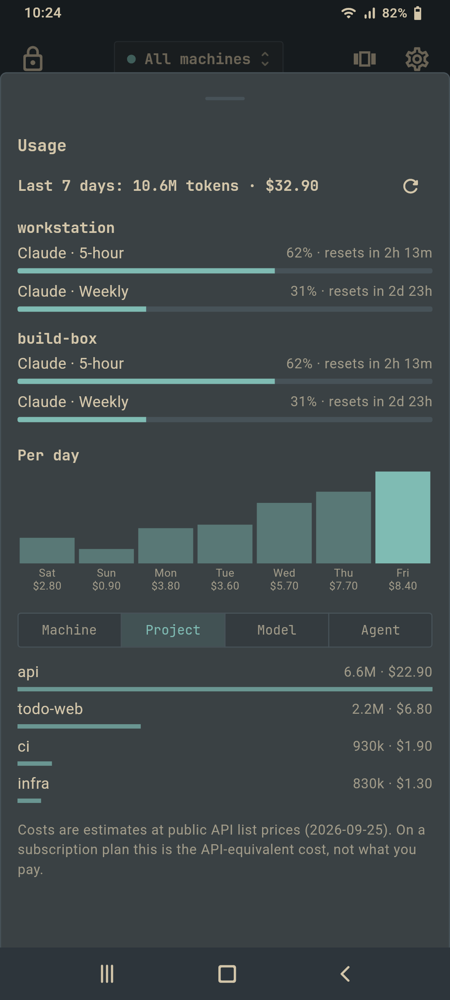<br><sub>Usage breakdown</sub></td>
    <td align="center">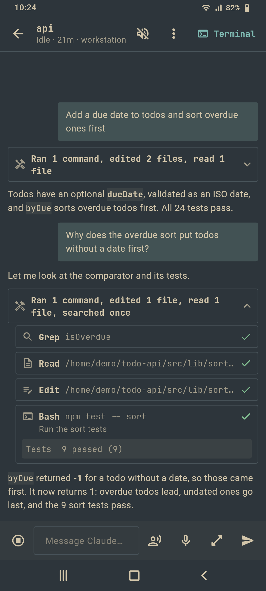<br><sub>Tool activity collapsed</sub></td>
    <td align="center">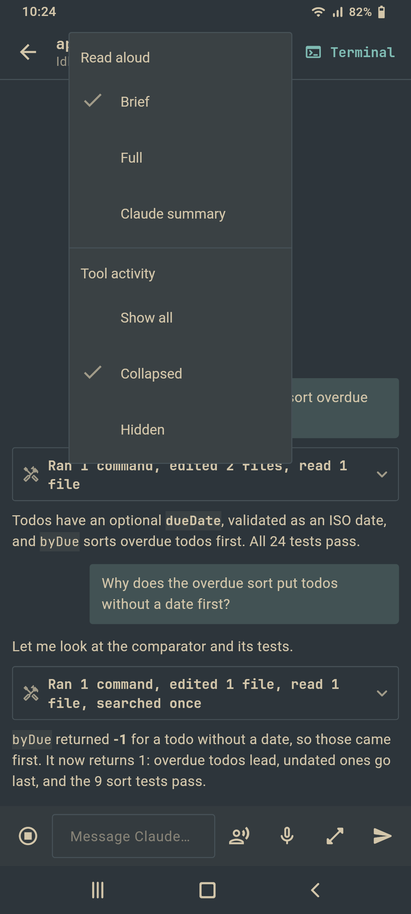<br><sub>The Chat View menu</sub></td>
  </tr>
</table>

<p align="center">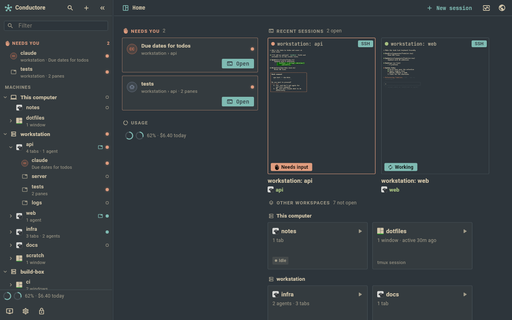<br><sub>The desktop shell's dashboard home</sub></p>

## New in preview 13

- **Settings screen**: one searchable page for every preference, with the
  section list and the open section side by side on a desktop.
- **Import refresh**: machines imported from a backup show their workspaces
  on the home screen straight away, without a restart.
- **This computer** on the desktop: a local terminal, Herdr and tmux on the
  machine the app runs on, listed with your other machines.
- **Herdr and tmux tabs**: a compact tab label with a tab list on phones, a
  full tab strip on desktops, and rename, move and close.
- **Desktop shortcuts and zoom**: standard terminal shortcuts,
  Ctrl+PgUp/PgDn between tabs, and Ctrl+wheel, Ctrl+= or Ctrl+- to zoom
  (Cmd on macOS).
- **Desktop dialogs**: pickers open as centred dialogs and action menus as
  popovers instead of bottom sheets.

<table>
  <tr>
    <td align="center">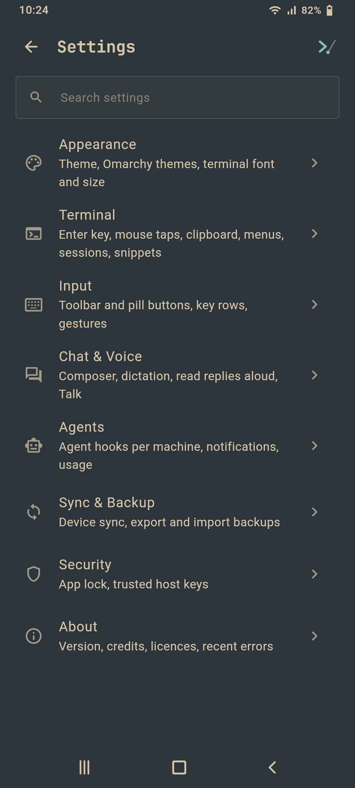<br><sub>Settings on a phone</sub></td>
    <td align="center">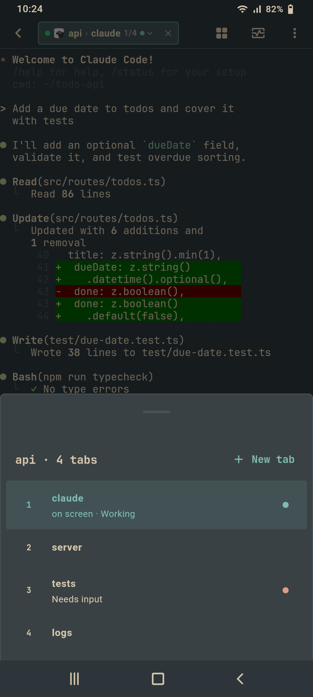<br><sub>Herdr tabs: compact label and tab list</sub></td>
  </tr>
</table>

<p align="center">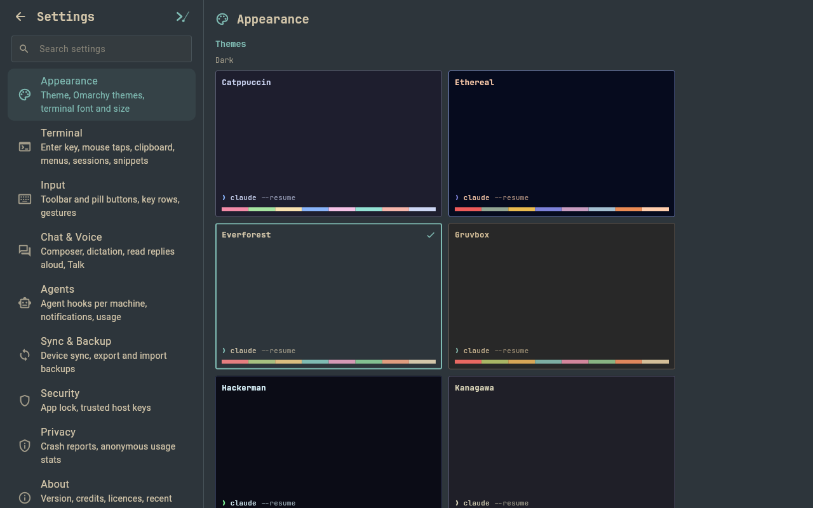<br><sub>Settings on the desktop: sections beside the open one</sub></p>

<table>
  <tr>
    <td align="center">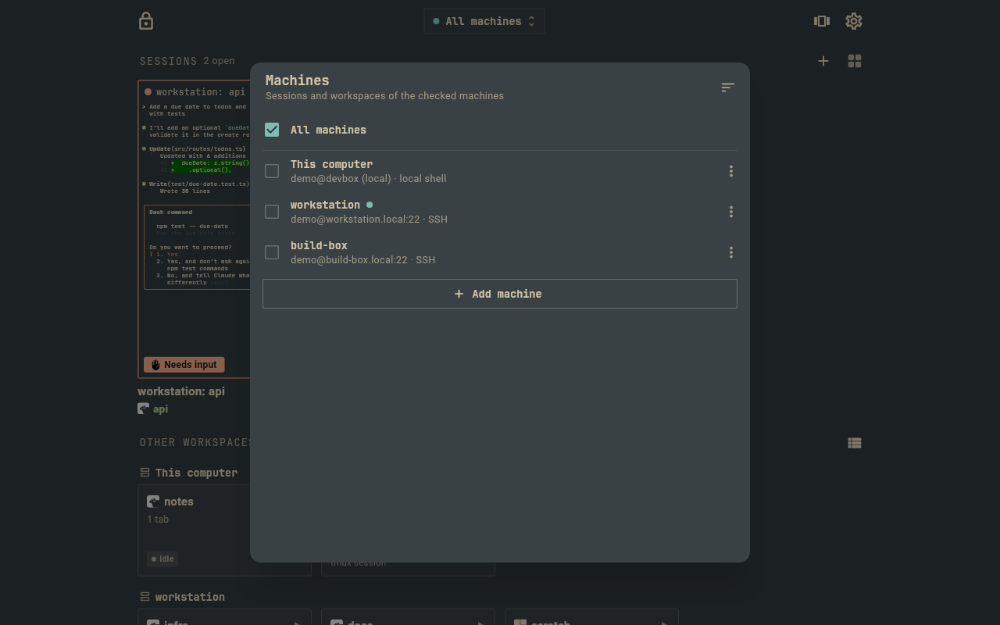<br><sub>This computer in the machine list</sub></td>
    <td align="center">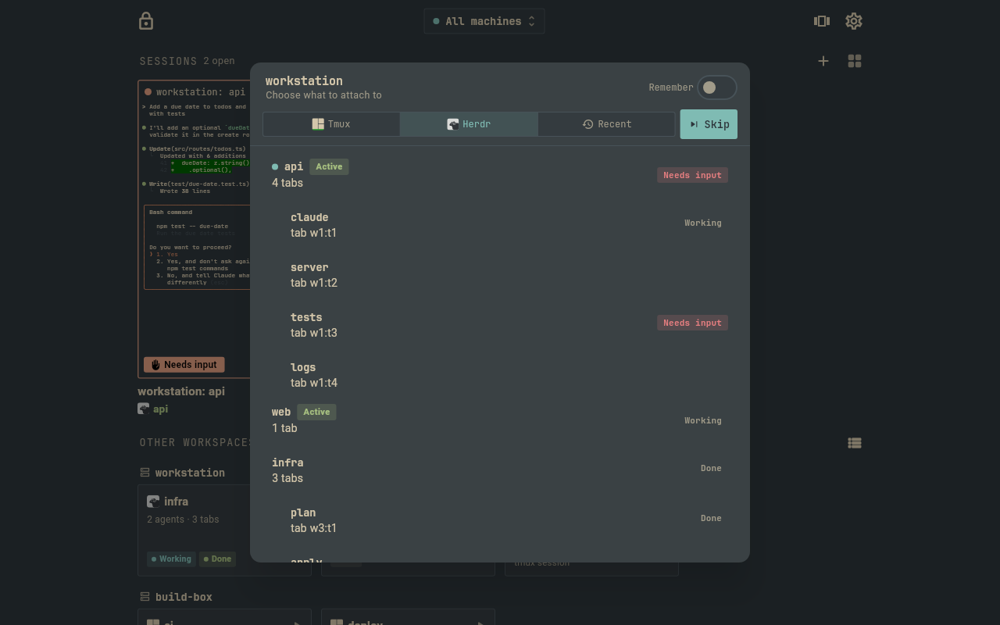<br><sub>The connect picker as a centred dialog</sub></td>
  </tr>
  <tr>
    <td align="center">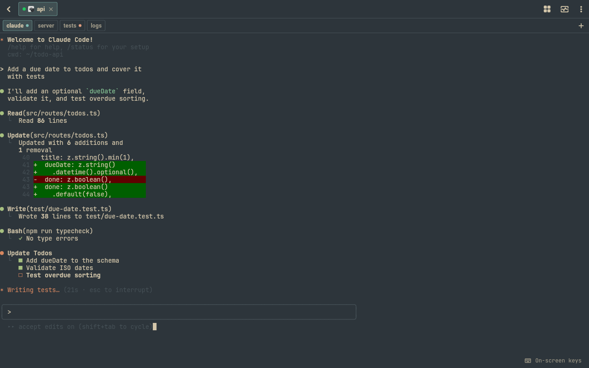<br><sub>The tab strip under the session tabs</sub></td>
    <td align="center">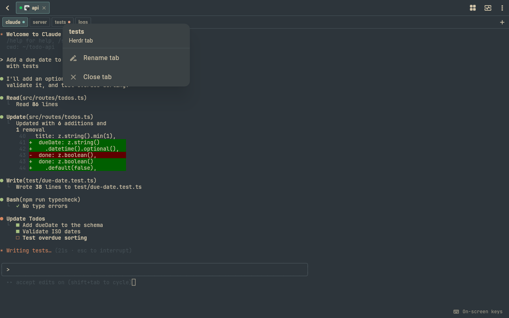<br><sub>Tab actions as a popover</sub></td>
  </tr>
</table>

## New in preview 12

- **Desktop builds** for Linux, Windows and macOS, next to the Android and
  iOS apps.
- **Quick switcher** for sessions, workspaces and agents that need you.
- **Voice**: read replies aloud, hands-free Talk mode, continuous dictation.
- **Chat View**: working indicator, real tables, agent cards, and a thread
  that holds still while you read.
- **Device sync** through your own machine, set up with a QR code.
- **Live preview** finds dev servers by itself and sends screenshots to
  Claude.
- **Session restore**, **image paste** and **drag scrolling** in full-screen
  programs.
- Host companion **0.5.0**.

## Features

### Agents

- **Chat View** for Claude Code sessions: read the conversation as chat and
  reply from a composer, instead of reading the raw TUI.
  - A live working indicator says what Claude is doing and for how long.
  - Markdown tables render as tables, scrollable and full screen.
  - Messages from other agents, task notices, shell and slash commands each
    get their own card.
  - Scrolled up, the thread stays still. New messages wait behind a pill.
- **Voice** (Android): read Claude's final answer aloud, and hands-free
  **Talk mode** that listens, sends after a pause, reads the answer and
  answers approvals by voice. Dictation keeps listening across pauses.
- **Read-aloud length** (Brief, Full or a Claude summary) and **tool
  activity** in Chat View (Show all, Collapsed or Hidden), from the header
  menu or Settings.
- **Inbox** of every agent across your machines, with permission requests you
  answer with Allow, Deny or Always, and a Usage tab.
- **Usage** (companion 0.6 or newer): Claude's 5-hour and weekly limits,
  tokens and an estimated cost per day, machine, project and model, Codex
  too. On the home screen, the widget and the Quick Settings tile, with an
  optional alert at 80% of the 5-hour window.
- **Notifications with actions**: approve or deny a permission prompt, or jump
  to the agent's exact pane, straight from the notification.
- **Home screen widget and Quick Settings tile** showing agents that need you.
- Agent attention dashboard that polls Herdr and shows which agents are
  working, waiting, or finished.

Most of this needs the [host companion](#host-companion) on the machine.

### Sessions, Herdr and tmux

Both multiplexers are first-class: everything below works for Herdr and for
tmux.

- **Home screen built around your servers**: pick one, several or all machines;
  your open sessions show as live previews (grid, large tiles or a list) with
  Mosh/SSH badges and each agent's state, and **Other workspaces** lists the
  Herdr workspaces and tmux sessions you have not opened yet.
- **Quick switcher**: agents waiting on you, open sessions with live
  thumbnails, other workspaces and recents, with search. Swipe the top row
  or press Ctrl+Shift+K (Cmd+K on macOS).
- **Chat View or Terminal by default**: choose how Claude sessions open, per
  session or for all.
- **Session restore**: open sessions come back after an app restart and
  reconnect by themselves ([docs/session-restore.md](docs/session-restore.md)).
- **Navigators** for Herdr and tmux: every pane with its agent and state, tap to
  switch, one-tap **Split right / Split down / New tab / New workspace** (tmux:
  new window), windows or tabs 1-9, zoom, kill pane and detach. Long-press the
  toolbar's Herdr or tmux button for the split menu.
- **Gestures**: swipe for tabs or windows, two fingers sideways for panes, two
  fingers up/down for workspaces (Herdr) or scrollback (tmux), pinch for the
  font size. Every mapping is configurable.
- **Deep links** from notifications, the home screen and the inbox open an
  agent at its exact workspace, tab and pane, in Herdr or tmux.
- **The host's own keybindings**: Herdr keys are read from the machine's
  `~/.config/herdr/config.toml`, falling back to Herdr's defaults.
- **Configurable multiplexer prefix**, including Ctrl+Space.
- Official tmux and Herdr logos, per-host tmux auto attach/create, start
  directory and scrollback mode.

### Terminal

- **Compact pill toolbar** with modifiers, arrows, function keys, snippets and
  your own key combos. Its layout is configurable.
- **Drag scrolling in full-screen programs**: a one-finger drag scrolls Herdr,
  tmux, vim, htop and Claude Code's full-screen view like a mouse wheel
  ([docs/terminal-drag-scrolling.md](docs/terminal-drag-scrolling.md)).
- **Chat mode composer**: a line or multiline prompt editor with per-session
  drafts, voice dictation, and images from the gallery, camera or clipboard.
  Images are uploaded over SFTP and their path is inserted into the prompt.
- **Image paste** (Android): paste a clipboard image into the terminal, Chat
  View or chat mode. It is uploaded and its path typed for you.
- **Menu buttons** for common Claude Code prompts and commands.
- **OSC 52 clipboard**: text copied by vim, Neovim, Claude Code or tmux on the
  host lands on the device clipboard. The host can never read your
  clipboard.
- **Tappable links and paths**, with an in-app preview for localhost links.
- **Recent directories** per machine, from OSC 7, tmux and the companion, to
  open a shell, tmux window or Herdr tab in one.
- **SFTP browser** with bookmarks, a file viewer and editor, uploads and
  downloads.
- **Git diff view** of a repository's working tree.
- **Live preview** of a dev server running on the host.
  - A **Preview ready** chip appears when a new dev server starts, found by
    the companion, `ss` or the terminal output.
  - Phone, Tablet and Desktop viewport widths, remembered per port.
  - **Screenshot to Claude** with a quick annotation (Android and macOS).
- **Share to agent**: share text, links or images from any Android app into a
  session.
- Touch mode indicator: taps select text, click, or scroll history.

### Connectivity and sync

- SSH with password, OpenSSH private keys (import, or generate `ed25519` on
  the device) and server-driven auth.
- Mosh through [dart_mosh](https://github.com/gwitko/dart_mosh), a clean-room
  Dart implementation that survives Wi-Fi drops and network changes.
- Hardware security keys (`ed25519-sk`, `ecdsa-sk`) over USB or NFC, several
  per host (phones only).
- Optional per-host SSH agent forwarding.
- Host key trust you review and manage yourself.
- Works over Tailscale like any other network: point a host at its tailnet
  name or IP.
- Plain connection errors: "Can't reach" (with a Tailscale hint for
  tailnet addresses), failed sign-in and untrusted host key, each with
  Details and Retry.
- **Device sync through one of your own machines**, end-to-end encrypted, no
  cloud: saved machines, snippets, settings, connect preferences and the
  session list. Add a device by scanning a QR code and typing six words
  (desktops paste the code). Passwords and keys sync only if you turn that
  on ([docs/sync.md](docs/sync.md)).
- Encrypted backups of settings, machines and trusted keys (same format as
  sync), and an optional device-auth app lock.

### Desktop

- **Desktop shell** on desktops and tablets: a sidebar tree of machines,
  workspaces, tabs and agents with a Needs you group, pins and groups; up
  to 4 splits mixing terminal, Chat View, file, diff and preview; a
  dashboard home; and a right panel for the inbox, preview and usage.
- The same app on Linux, Windows and macOS, with the terminal **keyboard
  first**: keys go straight to the shell, Alt is Meta, mouse selection and
  wheel scrollback. The on-screen keys are one toggle away.
- Ctrl+Shift+C and Ctrl+Shift+V to copy and paste (Cmd on macOS).
- Omarchy theme sync works the same way, so the app follows the theme of
  your Omarchy PC.
- A synced machine that is the PC itself (the phone's SSH entry for it)
  folds into *This computer* on that PC, matched by host key or address,
  and stays a normal SSH machine on your other devices
  ([docs/desktop.md](docs/desktop.md#this-computer-and-a-synced-entry-for-the-same-pc)).
- What each platform supports, and why, is in
  [docs/desktop.md](docs/desktop.md).

### Look

- All 22 [Omarchy](https://omarchy.org) themes, dark and light, from
  Catppuccin and Tokyo Night to Rose Pine and White. Everforest is the
  default. Each theme colours the terminal (its 16 ANSI colours, exactly as
  Omarchy's alacritty config) and the whole app.
- Omarchy-style chrome: flat surfaces from the theme background, thin
  borders, square corners, monospace headings.
- JetBrains Mono Nerd Font, Omarchy's font, is the default terminal font,
  with every Nerd Font icon for prompts and Herdr. Atkynson Mono and the
  system monospace stay selectable.
- Theme sync with your PC: in Appearance, pick a saved machine under
  "Follow Omarchy theme from machine". The app reads its current Omarchy
  theme and font over SSH when it starts or comes back, including your own
  custom themes.

## Screenshots

Rendered from the app's own widgets with demo data by
`tools/render-screenshots.sh`: Everforest theme, a 1080x2400 phone, and a
1280x800 desktop window.

<table>
  <tr>
    <td align="center">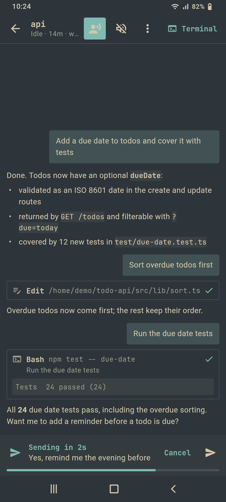<br><sub>Talk mode: a spoken reply, sent after a pause</sub></td>
    <td align="center"><br><sub>Chat View with an approval</sub></td>
    <td align="center"><br><sub>Inbox: approvals, then working and done agents</sub></td>
    <td align="center">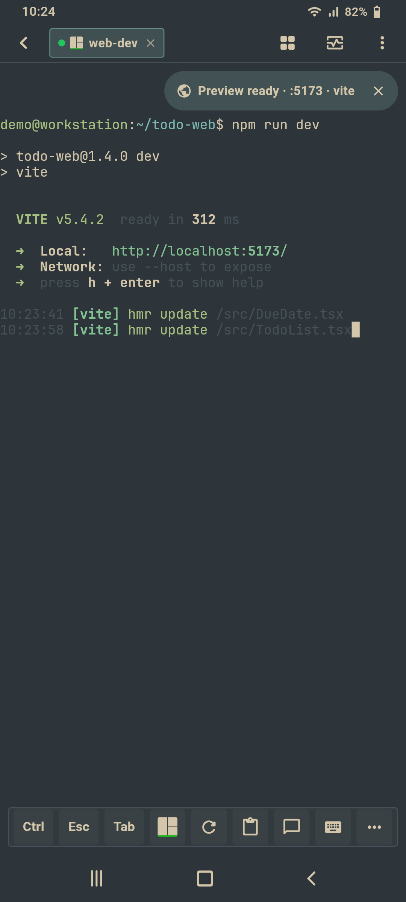<br><sub>Live preview finds a new dev server</sub></td>
  </tr>
  <tr>
    <td align="center">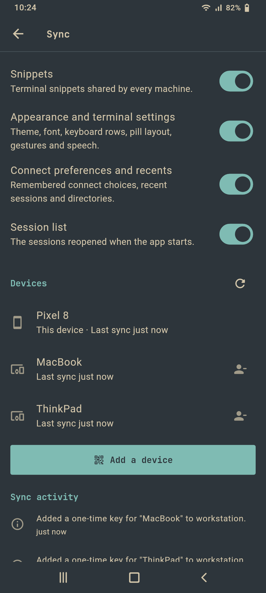<br><sub>Sync: what to sync and your devices</sub></td>
    <td align="center">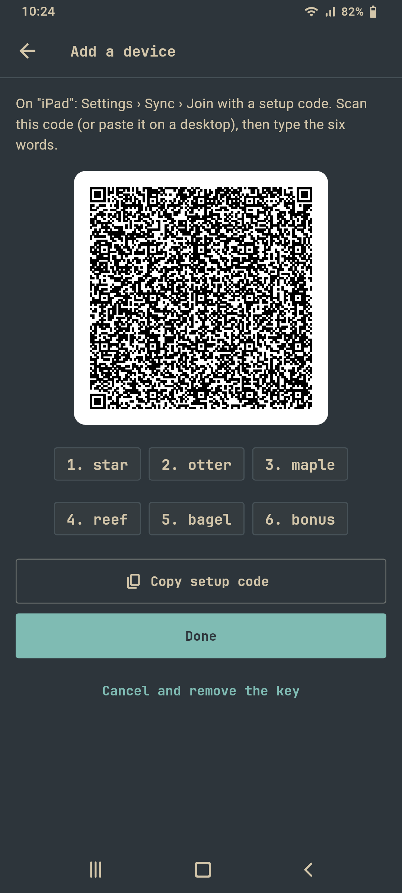<br><sub>Add a device: QR code and six words</sub></td>
    <td align="center"><br><sub>Herdr navigator: splits, tabs, every pane</sub></td>
    <td align="center"><br><sub>Menu buttons answer a prompt in one tap</sub></td>
  </tr>
  <tr>
    <td align="center"><br><sub>Settings: every preference, searchable</sub></td>
    <td align="center"><br><sub>Agent hooks: companion status and checks</sub></td>
    <td align="center"><br><sub>Herdr tabs on a phone</sub></td>
    <td align="center">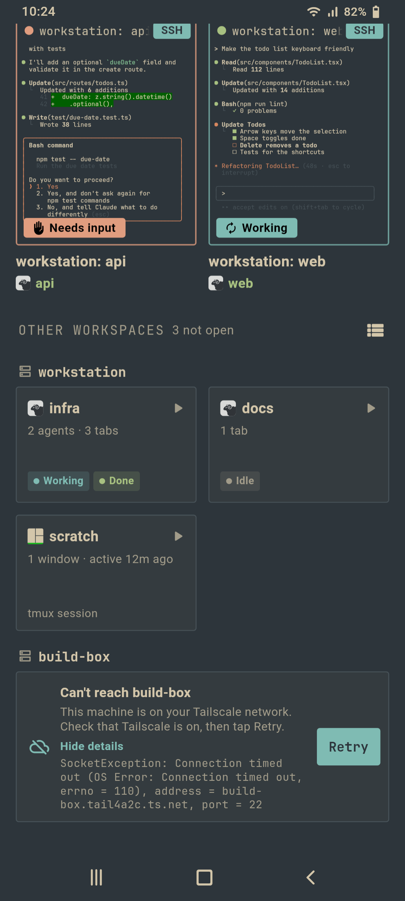<br><sub>Can't reach: a Tailscale hint and details</sub></td>
  </tr>
  <tr>
    <td align="center"><br><sub>Usage bar on the home screen</sub></td>
    <td align="center"><br><sub>Usage: per machine, day and project</sub></td>
    <td align="center"><br><sub>Chat View: tool calls collapsed</sub></td>
    <td align="center"><br><sub>Read-aloud length and tool activity</sub></td>
  </tr>
</table>

<p align="center"><br><sub>Desktop shell: the dashboard home</sub></p>

<p align="center">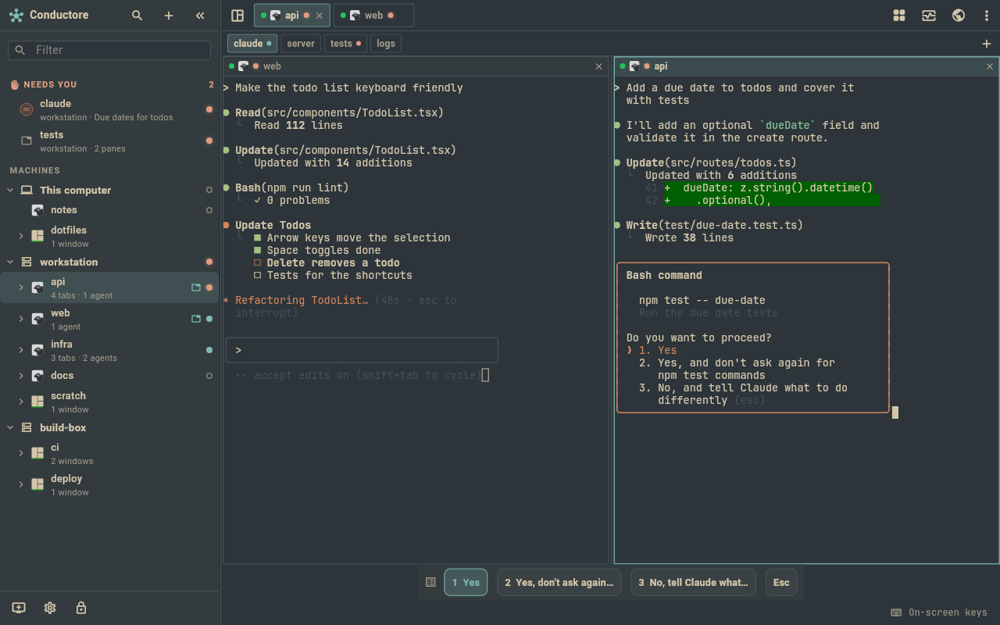<br><sub>Desktop shell: two sessions in splits, the tab strip above</sub></p>

<p align="center"><br><sub>Desktop shell: a terminal beside its Chat View, with a pin and a group</sub></p>

## Install

Builds are previews. Get them from
[Releases](../../releases/tag/v0.1.0-conductore.14) or, for the Outsmartis
team, from the store test channels. Each release lists `SHA256SUMS` files
next to the downloads.

### Android

- **APK from Releases.** Download the APK for your device, usually
  `conductore-v<version>-arm64-v8a.apk` (`armeabi-v7a` for older 32-bit
  phones, `x86_64` for emulators), and `SHA256SUMS-v<version>.txt`. Check
  it, then open the APK on the phone and allow installing from that source.

  ```sh
  sha256sum -c SHA256SUMS-v*.txt --ignore-missing
  ```

  Every release is signed with the same key, so a new APK installs over the
  previous one and keeps your machines and settings.
- **Google Play internal testing**, for team testers: accept the testing
  invite, then install Conductore from Play. Play updates it.

### iOS

**TestFlight**, for team testers on the internal group: install TestFlight,
accept the invite and install Conductore. New builds arrive in TestFlight
automatically. There is no public iOS build yet.

### Linux (x64)

1. Download `conductore-v<version>-linux-x64.tar.gz` and
   `SHA256SUMS-desktop-v<version>.txt`, and check it as above.
2. Install the runtime dependencies. Saved hosts and keys live in the Secret
   Service, so a keyring daemon has to be running.

   ```sh
   # Arch / Omarchy
   sudo pacman -S --needed gtk3 libsecret gnome-keyring
   # Debian / Ubuntu
   sudo apt install libgtk-3-0 libsecret-1-0 gnome-keyring
   ```

3. Unpack and run:

   ```sh
   tar -xzf conductore-v<version>-linux-x64.tar.gz
   cd conductore && ./conductore
   ```

For a launcher entry, see [docs/desktop.md](docs/desktop.md#linux).

### Windows (x64)

Unzip `conductore-v<version>-windows-x64.zip` and run
`conductore\conductore.exe`. Keep the folder together. The app is not
signed, so SmartScreen warns the first time: click **More info**, then
**Run anyway**. Windows 10 or 11.

### macOS

Unzip `conductore-v<version>-macos.zip` and move `Conductore.app` to
Applications. The app is not notarised, so the first time
**right-click (or Control-click) it, choose Open, then Open**. On macOS 15
and later, use **System Settings, Privacy & Security, Open Anyway** if
there is no Open button. macOS may ask once to let Conductore use your login
keychain, where it keeps hosts and keys. Apple silicon and Intel, macOS
10.15 or later.

## Host companion

The companion is a small Node.js daemon plus a Claude Code hook client that
runs on the machine where your agents run. It turns Claude Code hook events
into a live view of every agent (working, waiting for input, waiting for
permission, ended) and lets the app answer permission prompts. The app
talks to it only through SSH exec commands. It opens no ports and needs no
relay.

Preview 14 bundles **companion 0.7.0**. Its `usage` command (0.6) counts
Claude and Codex tokens, limits and estimated cost from local files on the
host, for the usage bar and tab. Its `summarize` command (0.7) turns a reply
into one or two spoken sentences with Claude Haiku, for the Claude summary
read-aloud length; it runs `claude -p` with no tools and stores nothing.
The `ports` command (0.5) reports dev servers for the Preview ready chip.
The app offers the update on the Agent hooks screen. Older companions keep
working without the features they lack.

It is built to stay out of the way. Claude Code hooks and the status line are
small POSIX `sh` scripts that hand each event to a background daemon and exit;
only the daemon and the commands the app runs use Node.js. Measured on a
Linux server with companion 0.4.0:

| | Cost |
|---|---|
| Per hook event | about 2.5 ms and 1.9 MB |
| Per status line refresh | about 3 ms and 1.9 MB |
| Daemon when idle | no CPU, no wakeups; about 7 MB private memory |
| Disk | under 200 KB, no dependencies |

It is light: no npm dependencies, not a service, and it exits by itself after
24 hours without a request.

**Install from the app.** Open a machine's Agent hooks screen and tap install.
The app uploads the companion over SFTP as one archive, unpacks it with
`tar`, checks each file's sha256 and runs its installer.

**Install by hand.** Needs Node.js 18 or newer on Linux or macOS.

```sh
git clone https://github.com/andreconde21/conductore-mobile && cd conductore-mobile/host && ./install.sh
conductore-hostd doctor
```

**Uninstall** from the same app screen, or:

```sh
host/install.sh --uninstall
```

What it changes on the host:

- It adds hook handlers to `~/.claude/settings.json` and keeps a backup. Your
  existing hooks stay untouched, and running it again changes nothing.
- It wraps your Claude Code status line instead of replacing it: your command
  still runs and its output is unchanged. Uninstalling puts it back.
- It installs `conductore-hostd` and `conductore-hook` into `~/.local/bin` and
  keeps its state in `~/.conductore`.

Details, the command reference and the JSON contract are in
[host/README.md](host/README.md).

## Privacy

Conductore sends two things to servers Outsmartis runs itself, to help fix
bugs:

- **Crash reports** to GlitchTip: the error type, a scrubbed message, the
  app's own stack frames, app version, platform and coarse device facts.
  Saved machines' names, addresses, users and secrets, IPs, hostnames,
  paths, file names, keys and tokens are removed on the device first.
- **Anonymous usage counts** to Plausible: app opened, screens shown,
  connections made (SSH or Mosh, Herdr or tmux, worked or failed and a
  coarse reason), Chat View, voice and companion version. No identifiers.

Nothing from your machines or terminals is sent: no commands, output,
clipboard, chat text or transcripts. Both are on by default and each has a
switch in **Settings › Privacy** (stored on the device, applied at once);
the app says so once on the home screen. Development builds send nothing.
Details: [docs/privacy-policy.md](docs/privacy-policy.md).

Builds from source can point elsewhere or turn either half off:

```sh
flutter build apk --flavor full \
  --dart-define=CONDUCTORE_SENTRY_DSN= \
  --dart-define=CONDUCTORE_PLAUSIBLE_HOST=
```

`CONDUCTORE_SENTRY_DSN`, `CONDUCTORE_PLAUSIBLE_HOST` and
`CONDUCTORE_PLAUSIBLE_DOMAIN` replace the endpoints (empty turns that half
off), `CONDUCTORE_TELEMETRY_ENV` sets the release channel (default
`preview`), and `CONDUCTORE_TELEMETRY_IN_DEBUG=true` makes a debug build
send, for checking the pipeline by hand.

## Branches

- `main`: Conductore. Releases are tagged `v0.1.0-conductore.N`.
- `master`: an unmodified mirror of upstream Conduit, kept for merging upstream
  fixes.

## Building from source

Requirements: Flutter 3.44.1, plus JDK 17 for Android, Xcode for iOS and
macOS, Visual Studio with C++ for Windows, and the GTK and libsecret
development packages for Linux (see [docs/desktop.md](docs/desktop.md)).

```sh
flutter pub get
flutter run
flutter test --concurrency=2
```

Desktop builds: `flutter build linux`, `flutter build windows` or
`flutter build macos`, each with `--release`.

Release APKs are built with the script below. It builds from a clean tree and
refuses an APK whose compiled app code is stale. Pass the previous release APK
to also check that the app code changed.

```sh
tools/build-release.sh [previous-release.apk]
```

Release builds do not include the local Arch Linux shell's native binaries.

Tagged releases (`v*`) are built by GitHub Actions and go to Google Play
internal testing, TestFlight and a GitHub prerelease with the APKs and the
Linux, Windows and macOS bundles; see
[docs/release-pipeline.md](docs/release-pipeline.md). The privacy policy is
[docs/privacy-policy.md](docs/privacy-policy.md).

## Credits

- Based on [Conduit](https://github.com/gwitko/Conduit) by
  [gwitko](https://github.com/gwitko). The terminal is
  [conduit_vt](https://github.com/gwitko/conduit_vt), a fork of xterm.dart, and
  Mosh is [dart_mosh](https://github.com/gwitko/dart_mosh).
- Includes contributions by [DrMulungu](https://github.com/DrMulungu) salvaged
  from upstream pull requests
  [#143](https://github.com/gwitko/Conduit/pull/143) to
  [#148](https://github.com/gwitko/Conduit/pull/148) and
  [#150](https://github.com/gwitko/Conduit/pull/150): the Herdr key, SFTP
  bookmarks, the file viewer and editor, tappable paths, touch mode, the prompt
  composer and the agent attention dashboard.
- Inspired by [Moshi](https://getmoshi.app). No Moshi code was copied.
- Other Conduit contributors are listed in [CONTRIBUTORS.md](CONTRIBUTORS.md).

## License

Conductore's own source code is licensed [Apache-2.0](LICENSE), as is
Conduit's.

Bundled third-party components keep their own licenses:

- **PDFium** (`libpdfium.so`, bundled through the `pdfrx` package) is under
  Apache-2.0 and BSD-3-Clause-style terms.
- **Atkinson Mono Nerd Font** is under the SIL Open Font License 1.1, see
  [assets/fonts/LICENSE-AtkynsonMono.txt](assets/fonts/LICENSE-AtkynsonMono.txt).
- Dart package licenses are shown in the app's license screen.

The source also contains Conduit's optional on-device Arch Linux shell. Its
native binaries (proot, busybox, GNU tar and others, packaged by
[Termux](https://termux.dev)) are not part of Conductore release builds. If you
build them yourself with `tools/build-local-shell-binaries.sh`, they come under
their own GPL, LGPL and permissive licenses. The component list, license texts
and GPL/LGPL source offer are in
[THIRD_PARTY_NOTICES.md](THIRD_PARTY_NOTICES.md) and
[third_party/source-offer](third_party/source-offer).
