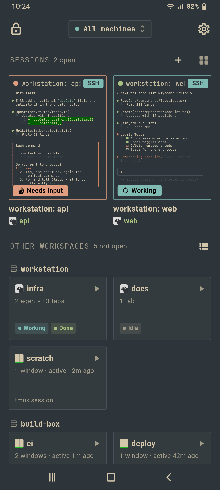
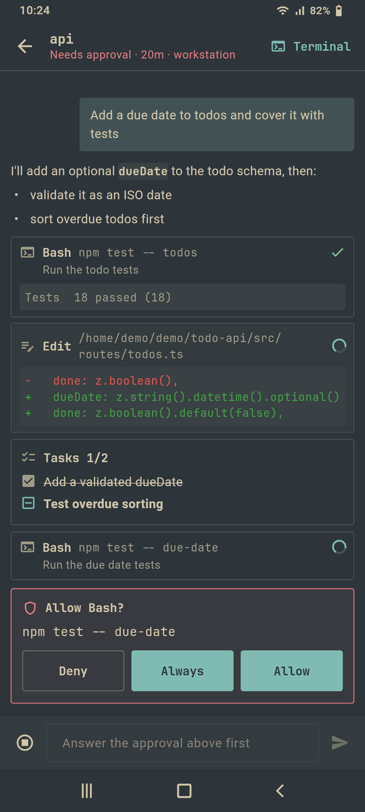
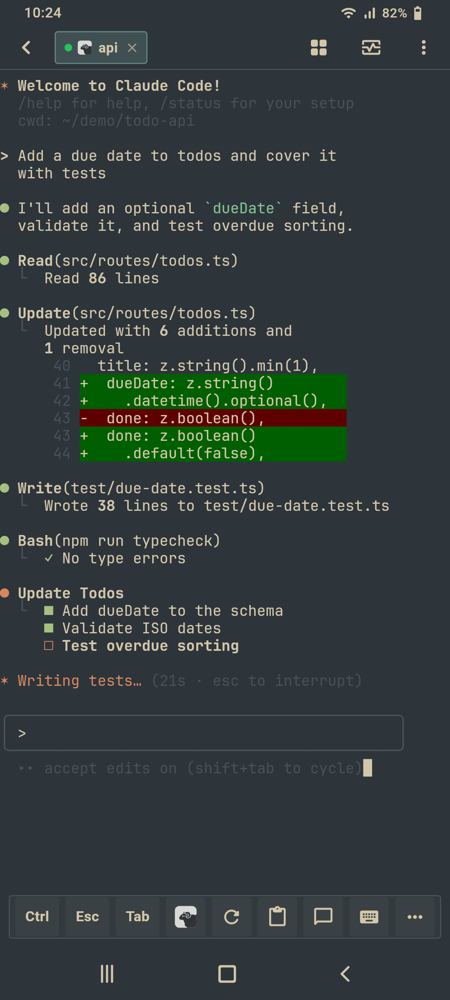
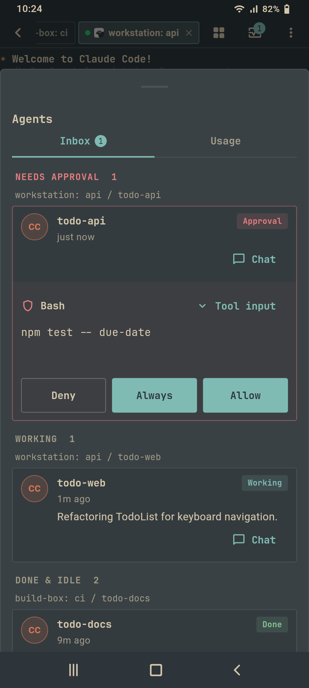
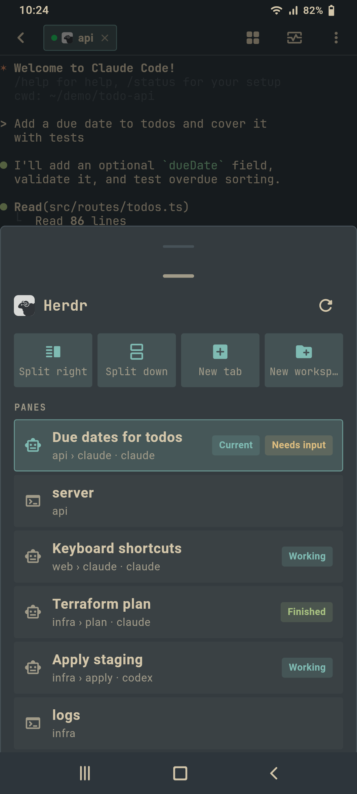
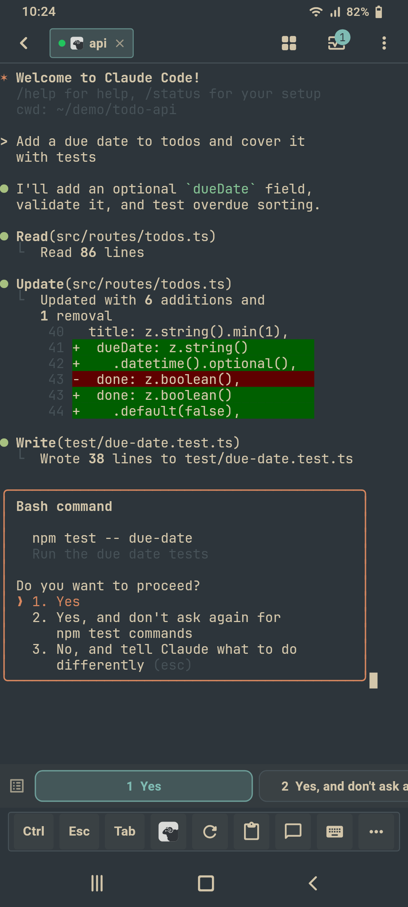
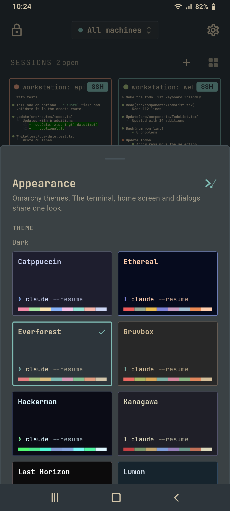
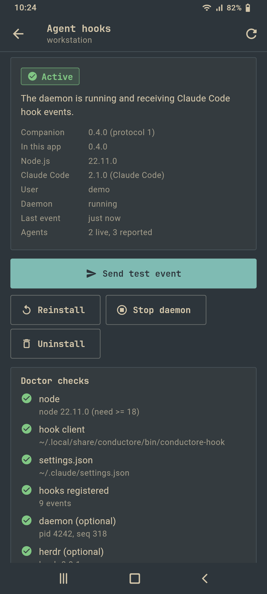

# Conductore

Drive Claude Code, Herdr and tmux sessions on your own machines from your phone, over SSH or Mosh, with no relay server and no account.

[](LICENSE)

[](../../releases)

Conductore is an Android app (iOS is not built yet). It is a fork of
[Conduit](https://github.com/gwitko/Conduit) by gwitko.

<table>
  <tr>
    <td align="center"><br><sub>Home: live sessions and other workspaces</sub></td>
    <td align="center"><br><sub>Chat View with an approval</sub></td>
    <td align="center"><br><sub>Terminal on a Herdr session</sub></td>
  </tr>
</table>

More in [Screenshots](#screenshots).

## Why

- **Your machines, your keys.** Hosts, keys and trusted fingerprints stay on
  the phone. No account, no cloud sync, no subscription.
- **No relay.** The phone connects straight to your machines over SSH or Mosh,
  usually through Tailscale. Nothing sits in the middle and nothing on the host
  listens on a new port.
- **Agents first.** The app is built around watching and steering coding agents
  (Claude Code) inside Herdr and tmux, not around a generic terminal.

## Features

### Agents

- **Chat View** for Claude Code sessions: read the conversation as chat and
  reply from a composer, instead of reading the raw TUI.
- **Inbox** of every agent across your machines, with permission requests you
  answer with Allow, Deny or Always, and a Usage tab (context and plan limits).
- **Notifications with actions**: approve or deny a permission prompt, or jump
  to the agent's exact pane, straight from the notification.
- **Home screen widget and Quick Settings tile** showing agents that need you.
- Agent attention dashboard that polls Herdr and shows which agents are
  working, waiting, or finished.

Most of this needs the [host companion](#host-companion) on the machine.

### Herdr and tmux

Both are first-class: everything below works for Herdr and for tmux.

- **Home screen built around your servers**: pick one, several or all machines;
  your open sessions show as live previews (grid, large tiles or a list) with
  Mosh/SSH badges and each agent's state, and **Other workspaces** lists the
  Herdr workspaces and tmux sessions you have not opened yet.
- **Navigators** for Herdr and tmux: every pane with its agent and state, tap to
  switch, one-tap **Split right / Split down / New tab / New workspace** (tmux:
  new window), windows or tabs 1-9, zoom, kill pane and detach. Long-press the
  toolbar's Herdr or tmux button for the split menu.
- **Gestures**: swipe for tabs or windows, two fingers sideways for panes, two
  fingers up/down for workspaces (Herdr) or scrollback (tmux), pinch for the
  font size. Every mapping is configurable.
- **Deep links** from notifications, the home screen and the inbox open an
  agent at its exact workspace, tab and pane, in Herdr or tmux.
- **The host's own keybindings**: Herdr keys are read from the machine's
  `~/.config/herdr/config.toml`, falling back to Herdr's defaults.
- **Configurable multiplexer prefix**, including Ctrl+Space.
- Official tmux and Herdr logos, per-host tmux auto attach/create, start
  directory and scrollback mode.

### Terminal

- **Compact pill toolbar** with modifiers, arrows, function keys, snippets and
  your own key combos. Its layout is configurable.
- **Chat mode composer**: a line or multiline prompt editor with per-session
  drafts, voice dictation, and images from the gallery, camera or clipboard.
  Images are uploaded over SFTP and their path is inserted into the prompt.
- **Menu buttons** for common Claude Code prompts and commands.
- **OSC 52 clipboard**: text copied by vim, Neovim, Claude Code or tmux on the
  host lands on the phone clipboard. The host can never read the phone
  clipboard.
- **Tappable links and paths**, with an in-app preview for localhost links.
- **Recent directories** per machine, from OSC 7, tmux and the companion, to
  open a shell, tmux window or Herdr tab in one.
- **SFTP browser** with bookmarks, a file viewer and editor, uploads and
  downloads.
- **Git diff view** of a repository's working tree.
- **Live preview** of a dev server running on the host.
- **Share to agent**: share text, links or images from any Android app into a
  session.
- Touch mode indicator: taps select text, click, or scroll history.

### Connectivity

- SSH with password, OpenSSH private keys (import, or generate `ed25519` on
  the phone) and server-driven auth.
- Mosh through [dart_mosh](https://github.com/gwitko/dart_mosh), a clean-room
  Dart implementation that survives Wi-Fi drops and network changes.
- Hardware security keys (`ed25519-sk`, `ecdsa-sk`) over USB or NFC, several
  per host.
- Optional per-host SSH agent forwarding.
- Host key trust you review and manage yourself.
- Works over Tailscale like any other network: point a host at its tailnet
  name or IP.
- Encrypted or secret-free backups of settings, machines and trusted keys, and
  an optional device-auth app lock.

### Look

- All 22 [Omarchy](https://omarchy.org) themes, dark and light, from
  Catppuccin and Tokyo Night to Rose Pine and White. Everforest is the
  default. Each theme colours the terminal (its 16 ANSI colours, exactly as
  Omarchy's alacritty config) and the whole app.
- Omarchy-style chrome: flat surfaces from the theme background, thin
  borders, square corners, monospace headings.
- JetBrains Mono Nerd Font, Omarchy's font, is the default terminal font,
  with every Nerd Font icon for prompts and Herdr. Atkynson Mono and the
  system monospace stay selectable.
- Theme sync with your PC: in Appearance, pick a saved machine under
  "Follow Omarchy theme from machine". The app reads its current Omarchy
  theme and font over SSH when it starts or comes back, including your own
  custom themes.

## Screenshots

Rendered from the app's own widgets with demo data by
`tools/render-screenshots.sh` (Everforest theme, a 1080x2400 phone).

<table>
  <tr>
    <td align="center"><br><sub>Inbox: approvals on top, then working and done agents by machine</sub></td>
    <td align="center"><br><sub>Herdr navigator: split, new tab or workspace, and every pane with its agent state</sub></td>
    <td align="center"><br><sub>Menu buttons answer a Claude Code prompt in one tap</sub></td>
  </tr>
  <tr>
    <td align="center"><br><sub>Appearance: the Omarchy themes</sub></td>
    <td align="center"><br><sub>Agent hooks: companion status and doctor checks</sub></td>
    <td></td>
  </tr>
</table>

## Install

Android only for now, arm64 devices.

1. Download the `arm64-v8a` APK and its `SHA256SUMS` file from
   [Releases](../../releases). Current builds are prereleases.
2. Check the checksum:

   ```sh
   sha256sum -c SHA256SUMS-*.txt --ignore-missing
   ```

3. Open the APK on the phone and allow installing from that source.

Every release is signed with the same key, so a new APK installs over the
previous one and keeps your machines and settings.

## Host companion

The companion is a small Node.js daemon plus a Claude Code hook client that
runs on the machine where your agents run. It turns Claude Code hook events
into a live view of every agent (working, waiting for input, waiting for
permission, ended) and lets the phone answer permission prompts. The phone
talks to it only through SSH exec commands. It opens no ports and needs no
relay.

It is built to stay out of the way. Claude Code hooks and the status line are
small POSIX `sh` scripts that hand each event to a background daemon and exit;
only the daemon and the commands the phone runs use Node.js. Measured on a
Linux server with companion 0.4.0:

| | Cost |
|---|---|
| Per hook event | about 2.5 ms and 1.9 MB |
| Per status line refresh | about 3 ms and 1.9 MB |
| Daemon when idle | no CPU, no wakeups; about 7 MB private memory |
| Disk | under 200 KB, no dependencies |
It is light: no npm dependencies, not a service, and it exits by itself after
24 hours without a request.

**Install from the app.** Open a machine's Agent hooks screen and tap install.
The app uploads the companion over SFTP and runs its installer.

**Install by hand.** Needs Node.js 18 or newer on Linux or macOS.

```sh
git clone https://github.com/andreconde21/conductore-mobile && cd conductore-mobile/host && ./install.sh
conductore-hostd doctor
```

**Uninstall** from the same app screen, or:

```sh
host/install.sh --uninstall
```

What it changes on the host:

- It adds hook handlers to `~/.claude/settings.json` and keeps a backup. Your
  existing hooks stay untouched, and running it again changes nothing.
- It wraps your Claude Code status line instead of replacing it: your command
  still runs and its output is unchanged. Uninstalling puts it back.
- It installs `conductore-hostd` and `conductore-hook` into `~/.local/bin` and
  keeps its state in `~/.conductore`.

Details, the command reference and the JSON contract are in
[host/README.md](host/README.md).

## Branches

- `main`: Conductore. Releases are tagged `v0.1.0-conductore.N`.
- `master`: an unmodified mirror of upstream Conduit, kept for merging upstream
  fixes.

## Building from source

Requirements: Flutter 3.44.1 and JDK 17.

```sh
flutter pub get
flutter run
flutter test --concurrency=2
```

Release APKs are built with the script below. It builds from a clean tree and
refuses an APK whose compiled app code is stale. Pass the previous release APK
to also check that the app code changed.

```sh
tools/build-release.sh [previous-release.apk]
```

Release builds do not include the local Arch Linux shell's native binaries.

## Credits

- Based on [Conduit](https://github.com/gwitko/Conduit) by
  [gwitko](https://github.com/gwitko). The terminal is
  [conduit_vt](https://github.com/gwitko/conduit_vt), a fork of xterm.dart, and
  Mosh is [dart_mosh](https://github.com/gwitko/dart_mosh).
- Includes contributions by [DrMulungu](https://github.com/DrMulungu) salvaged
  from upstream pull requests
  [#143](https://github.com/gwitko/Conduit/pull/143) to
  [#148](https://github.com/gwitko/Conduit/pull/148) and
  [#150](https://github.com/gwitko/Conduit/pull/150): the Herdr key, SFTP
  bookmarks, the file viewer and editor, tappable paths, touch mode, the prompt
  composer and the agent attention dashboard.
- Inspired by [Moshi](https://getmoshi.app). No Moshi code was copied.
- Other Conduit contributors are listed in [CONTRIBUTORS.md](CONTRIBUTORS.md).

## License

Conductore's own source code is licensed [Apache-2.0](LICENSE), as is
Conduit's.

Bundled third-party components keep their own licenses:

- **PDFium** (`libpdfium.so`, bundled through the `pdfrx` package) is under
  Apache-2.0 and BSD-3-Clause-style terms.
- **Atkinson Mono Nerd Font** is under the SIL Open Font License 1.1, see
  [assets/fonts/LICENSE-AtkynsonMono.txt](assets/fonts/LICENSE-AtkynsonMono.txt).
- Dart package licenses are shown in the app's license screen.

The source also contains Conduit's optional on-device Arch Linux shell. Its
native binaries (proot, busybox, GNU tar and others, packaged by
[Termux](https://termux.dev)) are not part of Conductore release builds. If you
build them yourself with `tools/build-local-shell-binaries.sh`, they come under
their own GPL, LGPL and permissive licenses. The component list, license texts
and GPL/LGPL source offer are in
[THIRD_PARTY_NOTICES.md](THIRD_PARTY_NOTICES.md) and
[third_party/source-offer](third_party/source-offer).
